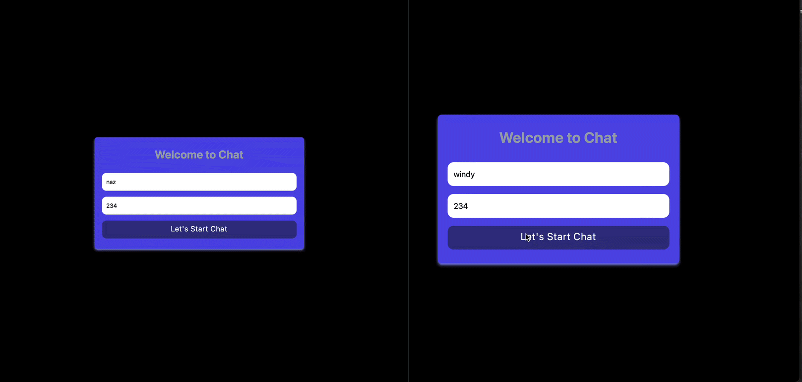

# Live-Chat-App

It is a live messaging application. I provided mutual messaging by logging in with username and room number. I provided messaging with hundreds of different people in different rooms at the same time.

# Technologies used

- Socket.io
- React
- Express
- nodejs
- tailwindcss

`running server with npm start`
`running client with npm start`

